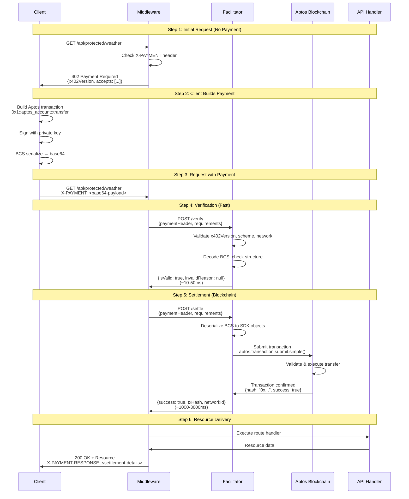

# x402 Payment Protocol - Complete Application Flow

> **Complete end-to-end documentation of the x402 payment flow on Aptos blockchain**  
> From initial request to settled payment and resource delivery

---

## Table of Contents

- [Overview](#overview)
- [Prerequisites](#prerequisites)
- [Architecture Diagram](#architecture-diagram)
- [Complete Flow Steps](#complete-flow-steps)
  - [Step 0: Environment Setup](#step-0-environment-setup)
  - [Step 1: Initial Request (No Payment)](#step-1-initial-request-no-payment)
  - [Step 2: Client Builds Payment](#step-2-client-builds-payment)
  - [Step 3: Request with Payment](#step-3-request-with-payment)
  - [Step 4: Payment Verification (Fast Path)](#step-4-payment-verification-fast-path)
  - [Step 5: Payment Settlement (Blockchain)](#step-5-payment-settlement-blockchain)
  - [Step 6: Resource Delivery](#step-6-resource-delivery)
- [Error Scenarios](#error-scenarios)
- [Performance Benchmarks](#performance-benchmarks)
- [Security Considerations](#security-considerations)
- [Implementation Files Reference](#implementation-files-reference)

---

## Overview

The x402 protocol enables HTTP 402 "Payment Required" responses for machine-to-machine micropayments. This implementation uses the Aptos blockchain for fast, low-cost settlements.

**Key Characteristics:**
- **Fast**: Verification in <50ms, settlement in 1-3 seconds
- **Atomic**: Payment is settled before resource delivery
- **Cryptographic**: BCS-encoded signed transactions
- **Standards-compliant**: Follows [Coinbase x402 specification](https://github.com/coinbase/x402)

**Payment Flow Summary:**
```
Client → GET /api/protected/weather
       ← 402 Payment Required (payment requirements)
       
Client → (sign Aptos transaction)
       
Client → GET /api/protected/weather + X-PAYMENT header
       
Server → Verify (fast, <50ms)
       → Settle (blockchain, 1-3s)
       ← 200 OK + Resource + Payment Receipt
```

---

## Prerequisites

### 1. Environment Variables

Required in `.env` or `.env.local`:

```env
# Payment recipient (server owner's Aptos address)
PAYMENT_RECIPIENT_ADDRESS=0x3dbd1c976225cd44bcc8bafc22ea2b78ccc9a83c5b3fee9ce8a67a6220230fa1

# Facilitator URL (handles verify & settle operations)
FACILITATOR_URL=http://localhost:3000/api/facilitator

# Demo client account (for testing)
DEMO_PRIVATE_KEY=0x21c31d63f7719d3de90b9c14b264229db65609f11f86413cb81a7ed7fcb18f3f
DEMO_ADDRESS=0xdcbddd6c678464228dc51e78d19672a5ff09cd4530e1f45e50cf1b941108c374
```

### 2. Funded Accounts

- **Payment Recipient**: Receives payments (no balance needed)
- **Client Account**: Must have APT balance for:
  - Payment amount (e.g., 1,000,000 Octas = 0.01 APT)
  - Gas fees (~100-500 Octas)

**Fund test accounts:**
```bash
npm run tsx scripts/generate-account.ts  # Generate & fund new account
```

Or manually at: https://aptoslabs.com/testnet-faucet

### 3. Dependencies

```bash
npm install @aptos-labs/ts-sdk@">=1.26.0"
npm install next@">=15.0.0"
```

---

## Architecture Diagram



---

## Complete Flow Steps

### Step 0: Environment Setup

**Before any requests, ensure:**

1. **Server Configuration** - `middleware.ts` at project root:

```typescript
// middleware.ts (lines 1-33)
import { paymentMiddleware } from "./lib/x402-middleware";

export const middleware = paymentMiddleware(
  process.env.PAYMENT_RECIPIENT_ADDRESS!,
  {
    "/api/protected/weather": {
      price: "1000000",  // 0.01 APT in Octas
      network: "testnet",
      config: {
        description: "Access to weather data API",
      },
    },
  },
  {
    url: process.env.FACILITATOR_URL!,
  }
);

export const config = {
  matcher: ["/api/protected/:path*"],
};
```

2. **Protected API Route** - No payment logic needed:

```typescript
// app/api/protected/weather/route.ts (lines 1-33)
import { NextRequest, NextResponse } from "next/server";

export async function GET(request: NextRequest) {
  // Payment already verified by middleware!
  return NextResponse.json({
    location: "San Francisco, CA",
    temperature: 72,
    conditions: "Sunny",
    // ... weather data
  });
}
```

3. **Facilitator Endpoints** - Must be deployed:
   - `app/api/facilitator/verify/route.ts`
   - `app/api/facilitator/settle/route.ts`

---

### Step 1: Initial Request (No Payment)

**What Happens:**
Client makes a request to a protected route WITHOUT payment.

**Client Request:**
```http
GET /api/protected/weather HTTP/1.1
Host: localhost:3000
```

**Server Processing:**

📄 **File:** `lib/x402-middleware.ts`  
📍 **Lines:** 25-95

```typescript
// 1. Middleware intercepts the request
export function paymentMiddleware(recipientAddress, routes, facilitatorConfig) {
  return async function middleware(request: NextRequest) {
    const pathname = request.nextUrl.pathname;
    
    // 2. Check if route is protected
    const routeConfig = routes[pathname];
    if (!routeConfig) {
      return NextResponse.next();  // Not protected, continue
    }
    
    // 3. Check for X-PAYMENT header
    const paymentHeader = request.headers.get("X-PAYMENT");
    
    // 4. Build payment requirements per x402 spec
    const paymentRequirements: PaymentRequirements = {
      scheme: "exact",
      network: "aptos-testnet",
      maxAmountRequired: routeConfig.price,
      resource: request.url,
      description: routeConfig.config?.description || "...",
      mimeType: "application/json",
      payTo: recipientAddress,
      maxTimeoutSeconds: 60,
      // ...
    };
    
    // 5. No payment? Return 402
    if (!paymentHeader) {
      const response402: PaymentRequiredResponse = {
        x402Version: 1,
        accepts: [paymentRequirements],
      };
      return NextResponse.json(response402, { status: 402 });
    }
    // ... (continues to verification if payment exists)
  };
}
```

**Server Response:**
```http
HTTP/1.1 402 Payment Required
Content-Type: application/json

{
  "x402Version": 1,
  "accepts": [{
    "scheme": "exact",
    "network": "aptos-testnet",
    "maxAmountRequired": "1000000",
    "resource": "http://localhost:3000/api/protected/weather",
    "description": "Access to weather data API",
    "mimeType": "application/json",
    "payTo": "0x3dbd1c976225cd44bcc8bafc22ea2b78ccc9a83c5b3fee9ce8a67a6220230fa1",
    "maxTimeoutSeconds": 60
  }]
}
```

**Timing:** ~10-50ms

---

### Step 2: Client Builds Payment

**What Happens:**
Client receives 402 response, builds and signs an Aptos transaction.

**Client Processing:**

📄 **File:** `lib/x402-client.ts`  
📍 **Lines:** 88-140

```typescript
// 1. Parse payment requirements from 402 response
const paymentRequirements = await initialResponse.json();
const { paymentAddress, price, network } = paymentRequirements.accepts[0];

// 2. Initialize Aptos SDK
const aptos = new Aptos(new AptosConfig({ network: Network.TESTNET }));
const account = Account.fromPrivateKey({ privateKey });

// 3. Build transfer transaction
const transaction = await aptos.transaction.build.simple({
  sender: account.accountAddress,
  data: {
    function: "0x1::aptos_account::transfer",
    functionArguments: [
      paymentRequirements.payTo,           // Recipient
      paymentRequirements.maxAmountRequired // Amount in Octas
    ],
  },
});

// 4. Sign transaction (offline, no blockchain interaction)
const authenticator = aptos.transaction.sign({ 
  signer: account, 
  transaction 
});

// 5. Serialize to BCS (Binary Canonical Serialization)
const transactionBytes = transaction.bcsToBytes();
const signatureBytes = authenticator.bcsToBytes();

// 6. Base64 encode for HTTP transport
const transactionBase64 = Buffer.from(transactionBytes).toString('base64');
const signatureBase64 = Buffer.from(signatureBytes).toString('base64');

// 7. Create payment payload per x402 spec
const paymentPayload = {
  x402Version: 1,
  scheme: "exact",
  network: "aptos-testnet",
  payload: {
    signature: signatureBase64,
    transaction: transactionBase64
  }
};

// 8. Base64 encode the entire payload
const paymentHeader = Buffer.from(JSON.stringify(paymentPayload)).toString('base64');
```

**Payment Payload Structure:**
```json
{
  "x402Version": 1,
  "scheme": "exact",
  "network": "aptos-testnet",
  "payload": {
    "signature": "AQC...==",  // Base64 BCS AccountAuthenticator
    "transaction": "AAAI...==" // Base64 BCS RawTransaction
  }
}
```

**Timing:** ~50-200ms (local signing, no network)

---

### Step 3: Request with Payment

**What Happens:**
Client retries the request with the X-PAYMENT header.

**Client Request:**
```http
GET /api/protected/weather HTTP/1.1
Host: localhost:3000
X-PAYMENT: eyJ4NDAyVmVyc2lvbiI6MSwic2NoZW1lIjoiZXhhY3QiLCJuZXR3b3JrIjoiYXB0b...
```

**Server Processing:**

📄 **File:** `lib/x402-middleware.ts`  
📍 **Lines:** 96-130

```typescript
// 1. Payment header found, parse it
const paymentPayloadJson = Buffer.from(paymentHeader, 'base64').toString('utf-8');
const paymentPayload: PaymentPayload = JSON.parse(paymentPayloadJson);

// 2. Validate x402 version
if (paymentPayload.x402Version !== 1) {
  return NextResponse.json(
    { error: "Unsupported x402 version" },
    { status: 400 }
  );
}

// 3. Validate scheme
if (paymentPayload.scheme !== "exact") {
  return NextResponse.json(
    { error: "Unsupported payment scheme" },
    { status: 400 }
  );
}

// Proceed to verification...
```

---

### Step 4: Payment Verification (Fast Path)

**What Happens:**
Facilitator validates payment structure WITHOUT submitting to blockchain.

**Middleware → Facilitator:**

📄 **File:** `lib/x402-middleware.ts`  
📍 **Lines:** 128-164

```typescript
// Call facilitator verify endpoint
const verifyRequest: VerifyRequest = {
  x402Version: 1,
  paymentHeader: paymentHeader,
  paymentRequirements: paymentRequirements,
};

const verifyResponse = await fetch(`${facilitatorUrl}/verify`, {
  method: "POST",
  headers: { "Content-Type": "application/json" },
  body: JSON.stringify(verifyRequest),
});

const verification: VerifyResponse = await verifyResponse.json();

if (!verification.isValid) {
  return NextResponse.json(
    { error: "Payment verification failed", message: verification.invalidReason },
    { status: 403 }
  );
}
```

**Facilitator Processing:**

📄 **File:** `app/api/facilitator/verify/route.ts`  
📍 **Lines:** 23-236

```typescript
export async function POST(request: NextRequest) {
  const { x402Version, paymentHeader, paymentRequirements } = await request.json();
  
  // 1. Validate x402 version
  if (x402Version !== 1) {
    return NextResponse.json({
      isValid: false,
      invalidReason: "Unsupported x402 version"
    });
  }
  
  // 2. Validate scheme
  if (paymentRequirements.scheme !== "exact") {
    return NextResponse.json({
      isValid: false,
      invalidReason: "Unsupported scheme"
    });
  }
  
  // 3. Validate network
  if (!paymentRequirements.network.startsWith('aptos-')) {
    return NextResponse.json({
      isValid: false,
      invalidReason: "Invalid Aptos network"
    });
  }
  
  // 4. Parse payment payload
  const paymentPayloadJson = Buffer.from(paymentHeader, 'base64').toString('utf-8');
  const paymentPayload: PaymentPayload = JSON.parse(paymentPayloadJson);
  
  // 5. Extract BCS components
  const signatureBase64 = paymentPayload.payload.signature;
  const transactionBase64 = paymentPayload.payload.transaction;
  
  if (!signatureBase64 || !transactionBase64) {
    return NextResponse.json({
      isValid: false,
      invalidReason: "Missing signature or transaction"
    });
  }
  
  // 6. Decode from base64
  const signatureBytes = Buffer.from(signatureBase64, 'base64');
  const transactionBytes = Buffer.from(transactionBase64, 'base64');
  
  // 7. Validate non-zero length
  if (signatureBytes.length === 0 || transactionBytes.length === 0) {
    return NextResponse.json({
      isValid: false,
      invalidReason: "Empty signature or transaction data"
    });
  }
  
  // ✅ Validation passed
  return NextResponse.json({
    isValid: true,
    invalidReason: null
  });
}
```

**Verification Checks:**
- ✅ x402Version === 1
- ✅ scheme === "exact"
- ✅ network starts with "aptos-"
- ✅ Signature and transaction are valid base64
- ✅ Both have non-zero length
- ⏭️ **NOT checked:** Cryptographic signature validity (done on-chain during settlement)

**Facilitator Response:**
```http
HTTP/1.1 200 OK
Content-Type: application/json
X-Verification-Time: 45

{
  "isValid": true,
  "invalidReason": null
}
```

**Timing:** ~10-50ms

---

### Step 5: Payment Settlement (Blockchain)

**What Happens:**
Facilitator deserializes BCS, submits transaction to Aptos blockchain.

**Middleware → Facilitator:**

📄 **File:** `lib/x402-middleware.ts`  
📍 **Lines:** 166-204

```typescript
// Call facilitator settle endpoint
const settleRequest: SettleRequest = {
  x402Version: 1,
  paymentHeader: paymentHeader,
  paymentRequirements: paymentRequirements,
};

const settleResponse = await fetch(`${facilitatorUrl}/settle`, {
  method: "POST",
  headers: { "Content-Type": "application/json" },
  body: JSON.stringify(settleRequest),
});

const settlement: SettleResponse = await settleResponse.json();

if (!settlement.success) {
  return NextResponse.json(
    { error: "Payment settlement failed", message: settlement.error },
    { status: 402 }
  );
}

// ✅ Payment settled! Continue to resource delivery...
```

**Facilitator Processing:**

📄 **File:** `app/api/facilitator/settle/route.ts`  
📍 **Lines:** 25-299

```typescript
export async function POST(request: NextRequest) {
  const { x402Version, paymentHeader, paymentRequirements } = await request.json();
  
  // 1. Parse payment payload (same as verify)
  const paymentPayloadJson = Buffer.from(paymentHeader, 'base64').toString('utf-8');
  const paymentPayload: PaymentPayload = JSON.parse(paymentPayloadJson);
  
  const signatureBase64 = paymentPayload.payload.signature;
  const transactionBase64 = paymentPayload.payload.transaction;
  
  // 2. Decode from base64
  const signatureBytes = Buffer.from(signatureBase64, 'base64');
  const transactionBytes = Buffer.from(transactionBase64, 'base64');
  
  // 3. Deserialize BCS back to SDK objects
  import { SimpleTransaction, AccountAuthenticator, Deserializer } from "@aptos-labs/ts-sdk";
  
  const transaction = SimpleTransaction.deserialize(
    new Deserializer(transactionBytes)
  );
  const senderAuthenticator = AccountAuthenticator.deserialize(
    new Deserializer(signatureBytes)
  );
  
  // 4. Initialize Aptos client
  const aptos = getAptosClient(paymentRequirements.network);
  
  // 5. Submit to blockchain (Pattern A: "Sender signs, anyone can submit")
  const committed = await aptos.transaction.submit.simple({
    transaction,
    senderAuthenticator,
  });
  
  console.log("Transaction hash:", committed.hash);
  
  // 6. Wait for blockchain confirmation
  await aptos.waitForTransaction({ 
    transactionHash: committed.hash 
  });
  
  // 7. Verify transaction succeeded
  const txDetails = await aptos.transaction.getTransactionByHash({
    transactionHash: committed.hash,
  });
  
  if (!('success' in txDetails) || !txDetails.success) {
    return NextResponse.json({
      success: false,
      error: "Transaction failed on blockchain",
      txHash: committed.hash,
      networkId: paymentRequirements.network,
    });
  }
  
  // ✅ Settlement successful!
  return NextResponse.json({
    success: true,
    error: null,
    txHash: committed.hash,
    networkId: paymentRequirements.network,
  });
}
```

**Blockchain Transaction:**
```
Function: 0x1::aptos_account::transfer
Arguments:
  - Recipient: 0x3dbd1c976225cd44bcc8bafc22ea2b78ccc9a83c5b3fee9ce8a67a6220230fa1
  - Amount: 1000000 (Octas)
Gas: ~100-500 Octas (paid by sender)
```

**Facilitator Response:**
```http
HTTP/1.1 200 OK
Content-Type: application/json
X-Settlement-Time: 1847

{
  "success": true,
  "error": null,
  "txHash": "0x8a4f2b1c9d3e5f7a0b8c1d4e6f9a2b5c8d1e4f7a0b3c6d9e2f5a8b1c4d7e0f3a",
  "networkId": "aptos-testnet"
}
```

**Timing:** ~1000-3000ms (blockchain confirmation)

**Gas Payment:**
- **Sender (client) pays gas** - deducted from client's account
- Facilitator only broadcasts, doesn't pay anything
- This is Pattern A: "Sender signs, anyone can submit"

---

### Step 6: Resource Delivery

**What Happens:**
Payment settled successfully, middleware executes API handler and returns resource.

**Middleware Processing:**

📄 **File:** `lib/x402-middleware.ts`  
📍 **Lines:** 206-240

```typescript
// 1. Execute the protected route handler
const response = await NextResponse.next();

// 2. Create payment response header per x402 spec
const paymentResponse = {
  settlement: settlement,  // Contains: success, txHash, networkId
};

// 3. Add X-PAYMENT-RESPONSE header (base64 encoded)
const responseHeaders = new Headers(response.headers);
responseHeaders.set(
  "X-Payment-Response",
  Buffer.from(JSON.stringify(paymentResponse)).toString('base64')
);

// 4. Add timing headers for debugging
responseHeaders.set('X-Verification-Time', verificationTime);
responseHeaders.set('X-Settlement-Time', settlementTime);

// 5. Return response with payment receipt
return new Response(response.body, {
  status: 200,
  headers: responseHeaders,
});
```

**API Handler Execution:**

📄 **File:** `app/api/protected/weather/route.ts`  
📍 **Lines:** 13-32

```typescript
export async function GET(request: NextRequest) {
  // Payment already verified & settled!
  // Just return the protected resource
  
  const weatherData = {
    location: "San Francisco, CA",
    temperature: 72,
    conditions: "Sunny",
    humidity: 65,
    // ...
  };

  return NextResponse.json(weatherData);
}
```

**Final Response to Client:**
```http
HTTP/1.1 200 OK
Content-Type: application/json
X-Payment-Response: eyJzZXR0bGVtZW50Ijp7InN1Y2Nlc3MiOnRydWUsImVycm9yIjpudWxsLCJ0eEhhc2...
X-Verification-Time: 45
X-Settlement-Time: 1847

{
  "location": "San Francisco, CA",
  "temperature": 72,
  "conditions": "Sunny",
  "humidity": 65,
  "windSpeed": 8,
  "forecast": [...]
}
```

**Client can decode X-Payment-Response:**
```javascript
const paymentResponseHeader = response.headers.get('x-payment-response');
const paymentDetails = JSON.parse(
  Buffer.from(paymentResponseHeader, 'base64').toString()
);

console.log('Transaction:', paymentDetails.settlement.txHash);
console.log('Network:', paymentDetails.settlement.networkId);
```

**Total Timing:** ~1900-3100ms (verification + settlement + API)

---

## Error Scenarios

### 1. Missing Payment Header

**Request:** No X-PAYMENT header  
**Response:** 402 Payment Required  
**File:** `lib/x402-middleware.ts:84-94`

```json
{
  "x402Version": 1,
  "accepts": [{...}]
}
```

### 2. Invalid x402 Version

**Request:** `x402Version: 2` (unsupported)  
**Response:** 400 Bad Request  
**File:** `lib/x402-middleware.ts:112-118`

```json
{
  "error": "Unsupported x402 version: 2"
}
```

### 3. Invalid Scheme

**Request:** `scheme: "upto"` (not implemented)  
**Response:** 400 Bad Request  
**File:** `lib/x402-middleware.ts:120-126`

```json
{
  "error": "Unsupported payment scheme: upto"
}
```

### 4. Verification Failed

**Cause:** Malformed BCS, invalid base64, empty data  
**Response:** 403 Forbidden  
**File:** `lib/x402-middleware.ts:152-162`

```json
{
  "error": "Payment verification failed",
  "message": "Empty signature or transaction data"
}
```

### 5. Insufficient Balance

**Cause:** Client doesn't have enough APT for payment + gas  
**Response:** 402 Payment Required  
**File:** `app/api/facilitator/settle/route.ts:210-218`

```json
{
  "success": false,
  "error": "INSUFFICIENT_BALANCE_FOR_TRANSACTION_FEE",
  "txHash": null,
  "networkId": "aptos-testnet"
}
```

### 6. Duplicate Transaction (Replay)

**Cause:** Same transaction submitted twice  
**Response:** 409 Conflict  
**File:** `app/api/facilitator/settle/route.ts:277-287`

```json
{
  "success": false,
  "error": "Transaction already used",
  "txHash": null,
  "networkId": null
}
```

### 7. Transaction Failed On-Chain

**Cause:** Blockchain rejected transaction  
**Response:** 402 Payment Required (with txHash)  
**File:** `app/api/facilitator/settle/route.ts:242-250`

```json
{
  "success": false,
  "error": "Transaction failed on blockchain",
  "txHash": "0x...",
  "networkId": "aptos-testnet"
}
```

---

## Performance Benchmarks

### Timing Breakdown

| Operation | Duration | File | Lines |
|-----------|----------|------|-------|
| **Initial 402 Response** | 10-50ms | `x402-middleware.ts` | 84-94 |
| **Client Sign Transaction** | 50-200ms | `x402-client.ts` | 97-140 |
| **Payment Verification** | 10-50ms | `facilitator/verify/route.ts` | 23-236 |
| **Payment Settlement** | 1000-3000ms | `facilitator/settle/route.ts` | 25-299 |
| **API Handler** | 10-100ms | `protected/weather/route.ts` | 13-32 |
| **TOTAL (with payment)** | **1100-3400ms** | - | - |

### Network Comparison

| Network | Block Time | Settlement Duration |
|---------|------------|---------------------|
| Aptos Testnet | ~1-3s | ~1000-3000ms |
| Aptos Mainnet | ~1-3s | ~1000-3000ms |
| Ethereum | ~12s | ~12000-15000ms |
| Base (L2) | ~2s | ~2000-4000ms |

**Aptos is 4-12x faster than EVM chains!**

### Cost Breakdown (Testnet)

| Item | Cost (Octas) | Cost (APT) | USD (@ $10/APT) |
|------|-------------|------------|-----------------|
| Payment Amount | 1,000,000 | 0.01 | $0.10 |
| Gas Fee | ~100-500 | ~0.000001-0.000005 | ~$0.00001 |
| **Total Client Pays** | **~1,000,500** | **~0.010005** | **~$0.10001** |

**Facilitator pays:** $0 (just broadcasts transaction)

---

## Security Considerations

### 1. Trust Model

- **Client trusts facilitator** to submit transaction correctly
- **Server trusts facilitator** to verify/settle accurately
- **Facilitator cannot steal funds** - transaction is signed by client with specific recipient

### 2. Replay Protection

- **Aptos sequence numbers** prevent transaction replay
- Each transaction increments sender's sequence number
- Duplicate submissions return 409 Conflict

### 3. Transaction Expiration

- Transactions have `expiration_timestamp_secs`
- Default: 60 seconds from creation
- Expired transactions rejected by Aptos network

### 4. Network Validation

- Middleware validates network matches (testnet vs mainnet)
- Prevents accidental mainnet transactions in testnet env

### 5. Amount Validation

**Current:** Basic checks in verify endpoint  
**Future Enhancement:** Full BCS deserialization to verify:
- Transaction recipient === `paymentRequirements.payTo`
- Transaction amount === `paymentRequirements.maxAmountRequired`

This is optional - on-chain validation is the ultimate check.

---

## Implementation Files Reference

### Core Library Files

| File | Lines | Purpose |
|------|-------|---------|
| `lib/x402-middleware.ts` | 243 | Main middleware logic, intercepts requests |
| `lib/x402-protocol-types.ts` | 156 | x402 spec type definitions |
| `lib/x402-types.ts` | 21 | SDK configuration types |
| `lib/x402-client.ts` | 274 | Client SDK for automatic payment handling |
| `lib/facilitator-client.ts` | 206 | Facilitator API wrapper functions |
| `lib/aptos-utils.ts` | 179 | Aptos SDK utilities |

### API Routes

| File | Lines | Purpose |
|------|-------|---------|
| `app/api/facilitator/verify/route.ts` | 237 | Verify payment structure (fast) |
| `app/api/facilitator/settle/route.ts` | 300 | Settle payment on blockchain (slow) |
| `app/api/protected/weather/route.ts` | 33 | Example protected resource |

### Configuration

| File | Lines | Purpose |
|------|-------|---------|
| `middleware.ts` | 34 | Route protection configuration |
| `.env` | 14 | Environment variables |

### Scripts

| File | Lines | Purpose |
|------|-------|---------|
| `scripts/generate-account.ts` | 130 | Generate & fund test accounts |
| `scripts/fund-account.ts` | 83 | Fund existing accounts |
| `scripts/verify-keypair.ts` | - | Verify keypair validity |

### Documentation

| File | Purpose |
|------|---------|
| `docs/protocol-sequence.md` | x402 protocol sequence diagram |
| `docs/APPLICATION_FLOW.md` | **This file** - complete flow documentation |
| `specs/schemes/aptos-exact.md` | Aptos "exact" scheme specification |
| `README.md` | SDK installation and usage guide |

---

## Testing the Flow

### Manual Testing with curl

**1. Request without payment:**
```bash
curl http://localhost:3000/api/protected/weather
# Returns 402 with payment requirements
```

**2. Use client SDK:**
```typescript
import { createX402Client } from './lib/x402-client';
import { Network } from '@aptos-labs/ts-sdk';

const client = createX402Client({
  privateKey: process.env.DEMO_PRIVATE_KEY!,
  network: Network.TESTNET,
});

const response = await client.get('http://localhost:3000/api/protected/weather');
console.log('Weather data:', response.data);
console.log('Payment tx:', response.paymentDetails?.transactionHash);
```

### Automated Testing

See `tests/e2e/` for comprehensive integration tests:
- `facilitator.test.ts` - Verify & settle endpoint tests
- `server-flow.test.ts` - Middleware behavior tests
- `client-flow.test.ts` - Client SDK tests
- `full-payment-flow.test.ts` - End-to-end integration

**Run tests:**
```bash
npm test
npm run test:e2e
```

---

## Troubleshooting

### "Payment verification failed"

**Cause:** Malformed payment payload  
**Fix:** Check client is using correct BCS serialization

### "Transaction failed on blockchain"

**Cause:** Insufficient balance, invalid transaction  
**Fix:** Ensure client has enough APT for payment + gas

### "Transaction already used"

**Cause:** Replay attack or double submission  
**Fix:** This is expected behavior - generate new transaction

### Slow settlement (>5 seconds)

**Cause:** Network congestion  
**Fix:** Wait or increase gas price (future feature)

---

## Next Steps

### Production Readiness

- [ ] Add BCS validation in verify endpoint (optional)
- [ ] Implement rate limiting on facilitator
- [ ] Add monitoring/logging/alerts
- [ ] Deploy facilitator to separate infrastructure
- [ ] Test on Aptos mainnet with real APT
- [ ] Add payment caching to prevent duplicate settlements

### Feature Enhancements

- [ ] Support "upto" scheme for metered usage
- [ ] Multi-currency support (fungible assets)
- [ ] Fee-payer flow (facilitator pays gas)
- [ ] Batch payments
- [ ] Payment subscriptions

---

**Last Updated:** October 2025  
**Protocol Version:** x402 v1  
**SDK Version:** @adipundir/aptos-x402 v0.1.2


